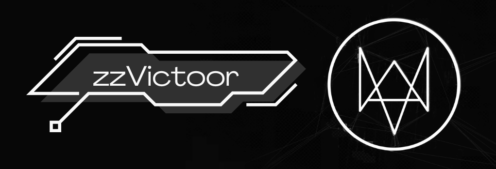

------------------------------ 

------------------------------

## Sobre

Informações:
- 🌎 Nacionalidade: Brasileiro;
- 💬 Idiomas: Português, Inglês;
- 🌐 País: Portugal;

Maybe you know me as: Victor35436

## Redes sociais / Contato

## Interesses

## Ambientes de trabalho

------------------------------

