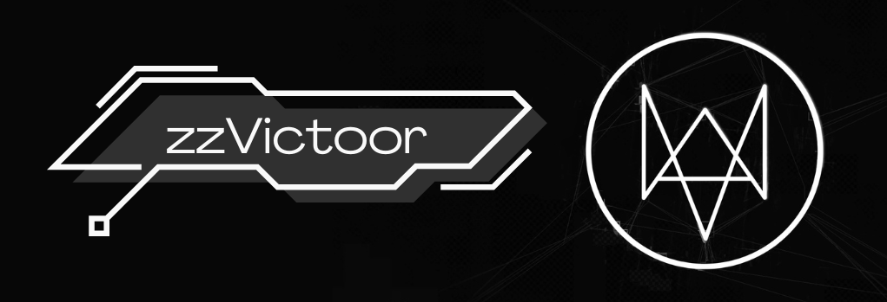

------------------------------ 

------------------------------

## Um pouco sobre mim

Olá, me chamo Victor, tenho 18 anos e sou um programador buscando sempre aprender algo novo.

Antigamente meu nickname em tudo era "victor35436", mas agora estou com uma nova identidade virtual, "zz.victor" ou "zzvictoor" pois quero ser conhecido com um nome mais simples.
Obviamente não há como eu definir esse nome em todas as redes sociais devido ao fato de muitas pessoas já terem escolhido esse nome de utilizador, atualmente, quase todas as minhas redes sociais tem esses novos nomes.
Só utilizo o zzvictoor pois há muitos lugares em que não aceitam "." no perfil, por causa desses, eu não posso usar sempre "zz.victor".

## Redes sociais

Portanto, minhas redes sociais são:

Discord: zzvictor
Instagram, Spotify: zz.victor
Twitter, Pinterest, Steam: zzvictoor

## Linguagem

Atualmente possuo conhecimento com linguagens de marcação, como por exemplo:

[[HTML](https://img.shields.io/badge/HTML-239120?style=for-the-badge&logo=html5&logoColor=white)](https://github.com/zzvictoor)
------------------------------
