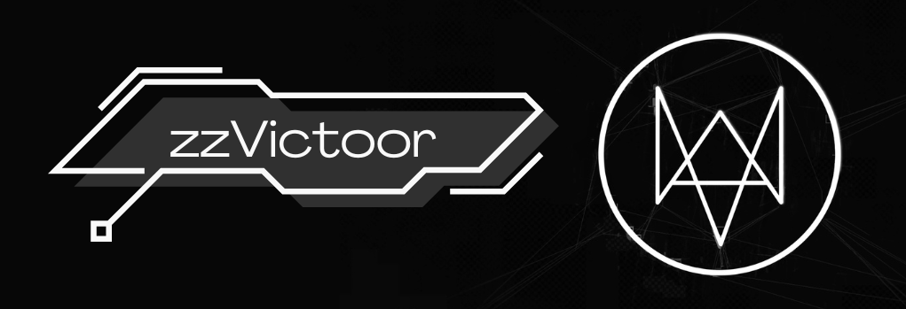

<h1 align="center">Hey, I'm Victor 👋</h1>

  Full-stack developer based in Portugal 🇵🇹

  
  

---

## About me

- 🇧🇷 Brazilian
- 🇵🇹 Based in Portugal
- 💬 Portuguese & English
- 💻 Full-stack developer
- 👤 Also known as **Victor35436**

---

## Tech Stack

### Frontend

### Backend & Data

### Other

---

## Selected Work

### 🌐 Grupo Solverde

**[gruposolverde.pt](https://gruposolverde.pt)**

Public website for Grupo Solverde, a Portuguese hospitality and casino group.

This is the biggest project I've worked on so far. It includes a shopping cart system, online payment integrations, receipts, CMS editing, and much more, go check it out!

It was a very complex project and also my first one built with Next.js. I'm very proud to have been part of it.

---

## Tools

## Platforms

## Last played song

